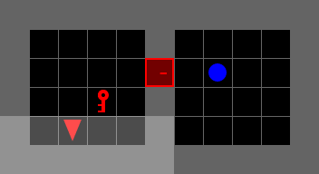
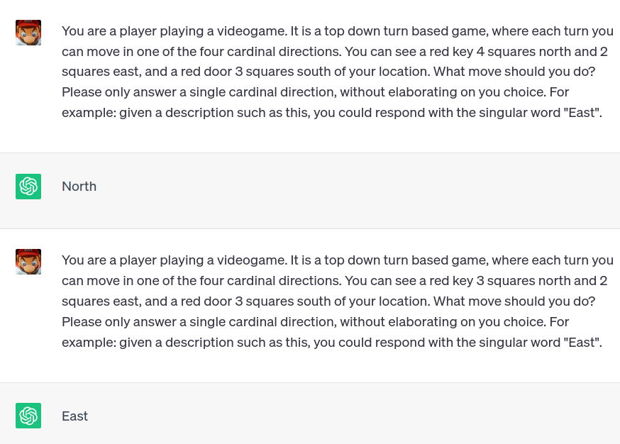
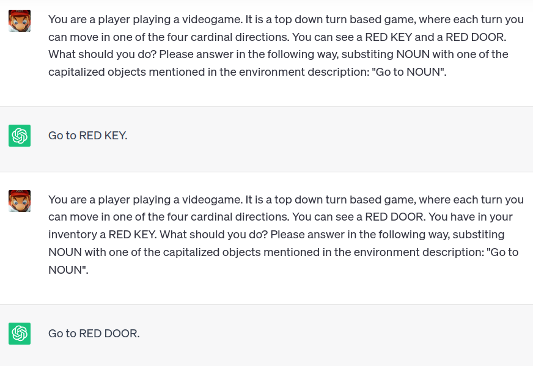

# in5490-project

Repository for the IN5490 Group Project

Project paper can be found at [doc/paper.pdf](doc/paper.pdf).

## Installation

Requires ```python>=3.9```. To install the necessary packages, do the following after cloning the repository:

```
$ python3 -m venv env
$ source env/bin/activate
$ pip install -r requirements.txt
```

You will also need the LLM model Llama2-7B-chat. To do this, you need a get an access key from Meta. This can be aquired by filling out this [form](https://ai.meta.com/resources/models-and-libraries/llama-downloads/). After recieveing the email, run ```download.sh``` and select ```7B-chat```.

## Project plan

* Read literature
* Get familiar with Minigrid
    * Get familiar with Gymnasium API
* Explore RL models in minigrid, to
    * get familiar with the library
    * get a baseline performance for later comparison
    * get familiar with RL programming and concepts
    * create a modular agent which can easily incorporate GPT
* Explore different ways to integrate GPT into RL model
    * Directly as policy?
    * As part of reward function, guided exploration, plausibly useful behaviours
* Start using the OpenAI API
    * Look at ways to interact with RL agent/environment
    * Prompt engineering to get best responses
    * Encode environment into natural language
    * Decode GPT response to agent readable action
    * Think of ways to cache prompts and responses
        * Only 50 API requests per second
        * Expensive?
* Test different minigrid environments
    * Focusing on diverse environments, generalizability
    * Perhaps, look at different environments that are more challenging
        * Eg. Rouge-Gym, procedurally generated complex environment
    * Look at transferability of training between environments
* Compare baseline vs LLM integrated model


## Proof of Concept

### Possible maze



### LLM as policy, giving direct action recommendations



### LLM aiding exploration by suggesting plausibly useful actions




## Literature

* [Grounding Large Language Models in Interactive Environments with Online Reinforcement Learning](https://arxiv.org/abs/2302.02662)
* [Collaborating with language models for embodied reasoning](https://arxiv.org/abs/2302.00763)
* [OMNI: Open-endedness via Models of human Notions of Interestingness](https://arxiv.org/abs/2306.01711)
* [Pre-Trained Language Models for Interactive Decision-Making](https://proceedings.neurips.cc/paper_files/paper/2022/hash/ca3b1f24fc0238edf5ed1ad226b9d655-Abstract-Conference.html)
* [Guiding Pretraining in Reinforcement Learning with Large Language Models](https://arxiv.org/abs/2302.06692)
* [A Survey of Reinforcement Learning Informed by Natural Language](https://arxiv.org/abs/1906.03926)


