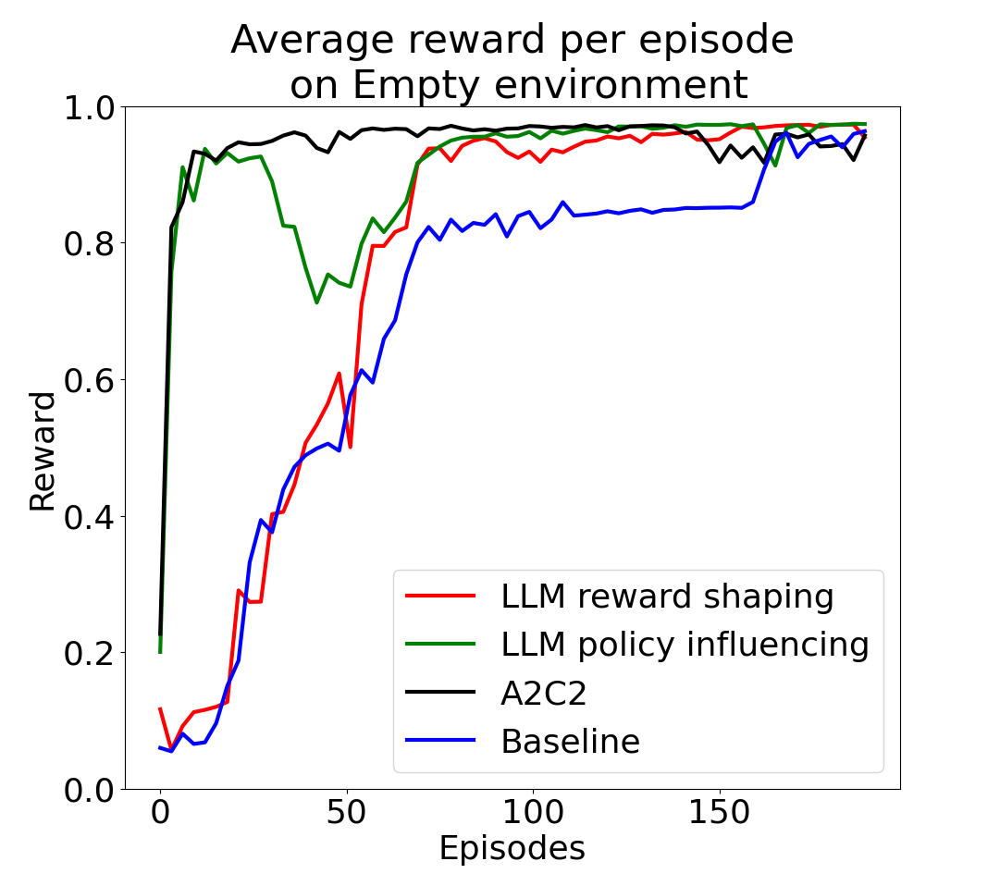
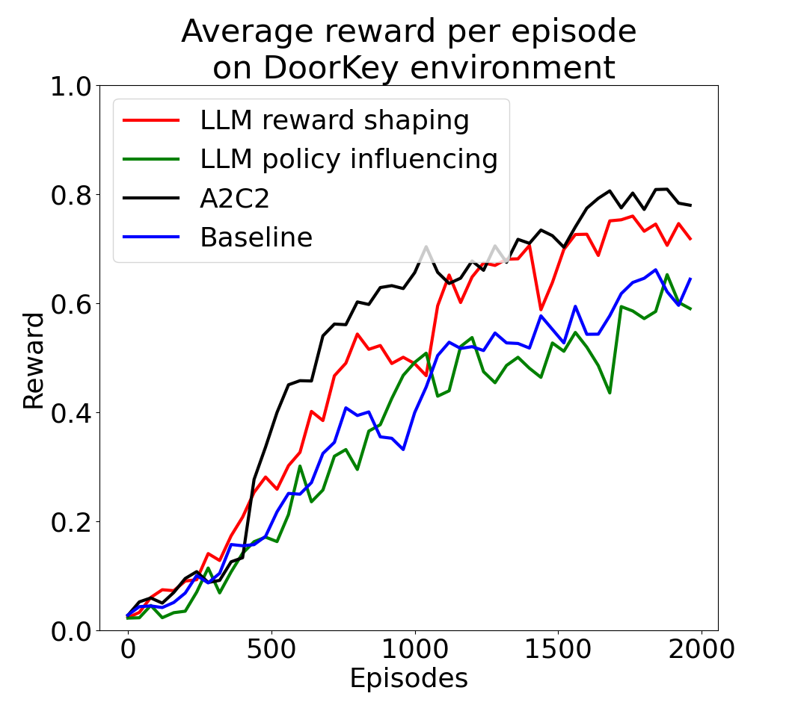
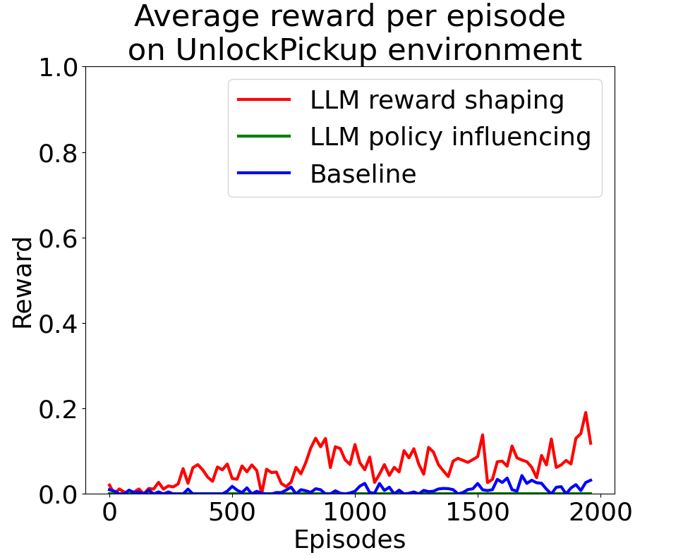

# Large Language Models in Reinforcement Learning - A Comparison of Methods

Repository for the paper produced for the course IN5490.

Project paper can be found at [doc/paper.pdf](doc/paper.pdf).

## Installation

Requires ```python>=3.10```. To install the necessary packages, do the following after cloning the repository:

```
$ python3 -m venv env
$ source env/bin/activate
$ pip install -r requirements.txt
```

You will also need the LLM model Llama2-7B-chat. To do this, you need a get an access key from Meta. This can be aquired by filling out this [form](https://ai.meta.com/resources/models-and-libraries/llama-downloads/). After recieveing the email, run ```download.sh``` and select ```7B-chat```.

## Results






